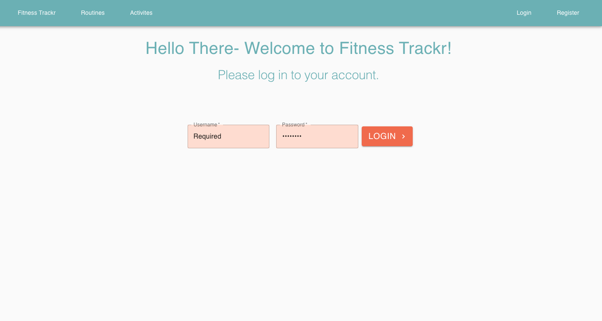

<h1 align="center">Fitness Trackr</h1>
<br>

> An app using a self-made backend server to keep track of fitness routines

<br>

## Deployment


[](https://app.netlify.com/sites/wonderful-mcnulty-b5ab78/deploys)

### 🌐  [Live Site](https://wonderful-mcnulty-b5ab78.netlify.app/)

  
<br>



  
## Tech Stack

**Client:** React

**Server:** Node, Express

**Database:** PostgreSQL, Test Driven Development [Repo](https://github.com/ekrebs1/Fitness_Trackr_Back_End)

  
## Features

- Create/Edit workout routines
- Add activities
- View other users routines

  
## Run Locally

Clone the project

```sh
  git clone https://github.com/ekrebs1/FitnessTrackr_React.git
```

Go to the project directory

```sh
  cd my-app
```

Install dependencies

```sh
  npm install
```

Start localhost:3000

```sh
npm run start 
```


  
## Roadmap

- Adjust react router
- Update UI
- Improve database accessibility

  
## License

[](https://github.com/tterb/atomic-design-ui/blob/master/LICENSEs)
  
